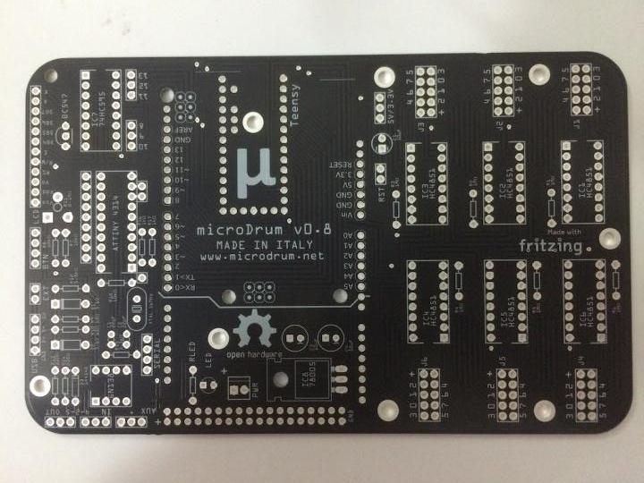
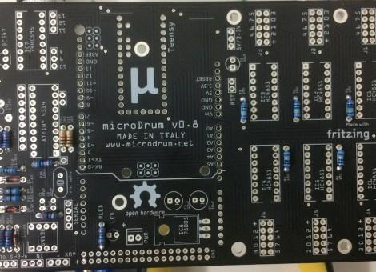
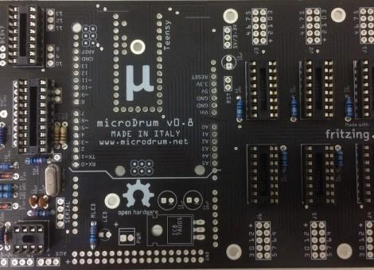
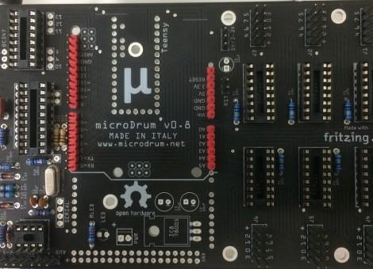
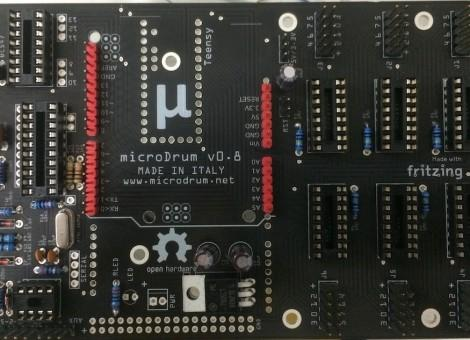

Unlike the v0.7, the mainboard v0.8 is a double layer PCB.

> Be aware that there are 2 silkscreen errors on it:
1. The [BC547](https://blogspot.tenettech.com/bc547-transistor.html) transistor
   must be welded reversed (EBC -> CBE).
2. The ATTINY4314 is a 4313 instead. 

There are some new components on it:

- The [ATtiny4313](http://www.microchip.com/wwwproducts/en/ATtiny4313) together
  with the 16 MHz crystal are used for the USB MIDI output.

- The IC7 [SN74HC595](http://www.ti.com/product/SN74HC595) is used to have more
  LCD controls.

- The IC8 [TL780-05](http://www.ti.com/lit/ds/symlink/tl780.pdf) voltage regulator.

> There is a [Teensy 3.1/3.2](https://www.pjrc.com/teensy/teensy31.html) support
  but it was not tested.

### Step 1 - Resistors and diodes

### Step 2 - IC Sockets, Crystal and Ceramic Capacitors

### Step 3 - Pin Strip Headers

### Step 4 - 78005 Voltage Regulator and 10µF Electrolytic Capacitors

